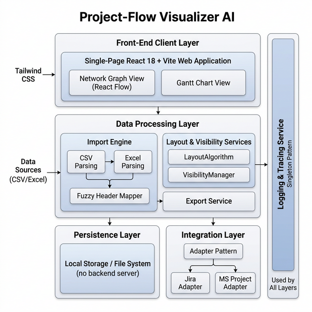
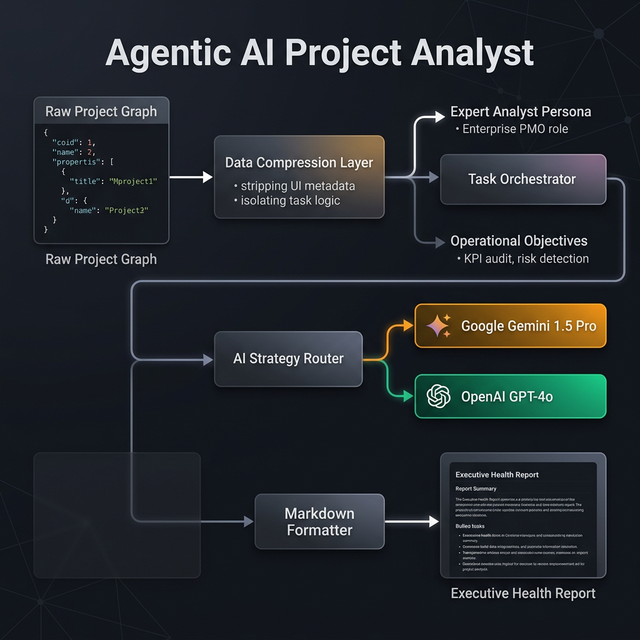

# Project-Flow Visualizer Software Architecture

This document provides a detailed overview of the architectural components and design patterns used in the Project-Flow Visualizer.

## Architecture Overview

The application is structured into clearly defined layers, emphasizing modularity, extensibility, and separation of concerns.

---

## 1. Front-End Client Layer
The user interface is a modern Single-Page Application (SPA) built with **React 18** and **Vite**.

- **Network Graph View (React Flow)**:
  - Visualizes project entities (Phases, Milestones, Tasks) as interactive nodes.
  - Displays dependency relationships through connecting edges.
  - Supports drill-down capabilities for focused analysis of specific project segments.
- **Gantt Chart View**:
  - Provides a chronological timeline of project activities.
  - Features draggable bars for intuitive schedule adjustments.
  - Displays start/end dates and real-time progress tracking.
- **Styling**: Uses **Tailwind CSS** for a premium, responsive, and consistent user experience.

## 2. Data Processing Layer
Responsible for data ingestion, transformation, and presentation logic.

- **Import Engine**: Implemented using the **Strategy Pattern** to handle diverse data sources.
  - **CSV Parsing Strategy**: Utilizes `PapaParse` for robust CSV handling.
  - **Excel Parsing Strategy**: Utilizes `SheetJS` for complex spreadsheet data.
  - **Fuzzy Header Mapper**: Automatically normalizes inconsistent input headers into a standard target schema.
- **Layout & Visibility Services**:
  - `LayoutAlgorithm`: Computes optimal node positioning for complex dependency graphs.
  - `VisibilityManager`: Handles zoom-based visibility and levels of detail (LOD) to maintain performance with large datasets.
- **Export Service**:
  - Generates standard CSV and Excel files.
  - Creates high-impact "Gamma-style" Markdown and PPTX dashboards for reporting.

## 3. Integration Layer
Designed for future-proofing the application using the **Adapter Pattern**.

- **External Adapters**: Planned integrations for **Jira** and **MS Project**, allowing the visualizer to act as a front-end for existing enterprise data.

## 4. Persistence Layer
Focuses on client-side data management to ensure privacy and offline capability.

- **Client-Side Storage**: Leverages **Local Storage** and the **File System API**.
- **Serverless Design**: The application operates entirely without a backend server, processing all data locally.

## 5. Logging & Tracing Service
A cross-cutting service implemented using the **Singleton Pattern**.

- **Unified Diagnostics**: Used by all layers to capture request IDs, events, and errors.
- **Debugging Support**: Provides a centralized stream of events to facilitate rapid troubleshooting.

## 6. Agentic AI Layer
The application integrates specialized AI capabilities designed for autonomous analysis.

### Evolution to Hierarchical MAS
Building on the initial agentic design, the system is evolving toward a **Hierarchical Multi-Agent System (MAS) Partition**. This transition introduces a tiered structure of **Departmental Supervisors** and **Ground-Level Workers** to ensure maximum precision.

For the full detailed design of this hierarchy, see the **[Hierarchical MAS Architecture](./MULTI_AGENT_ARCHITECTURE.md)**.

- **AI Health Analyst (Primary Persona)**:
  - Operates as the **Chief Orchestrator** in the hierarchical model.
  - **Graph Reasoning**: Analyzes JSON-based topological graphs.
  - **Data Compression Layer**: Programmatically optimizes the project dataset.
